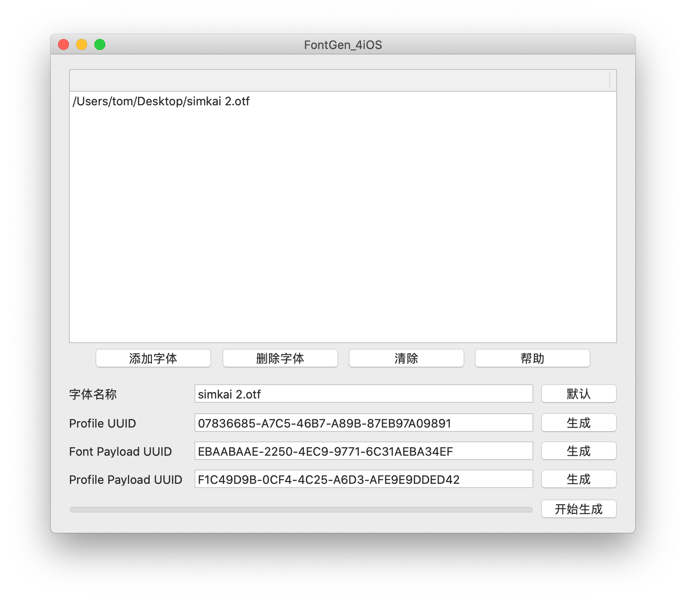
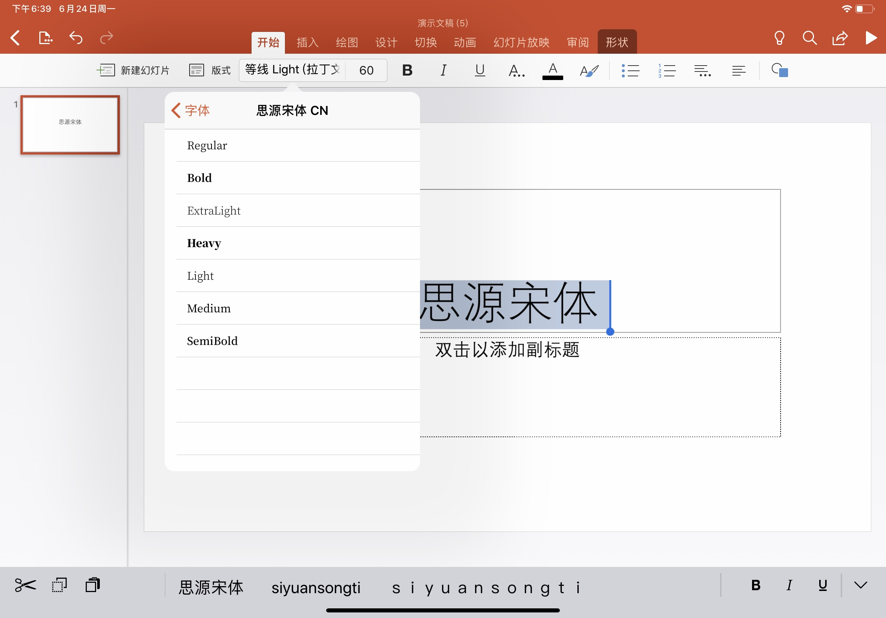
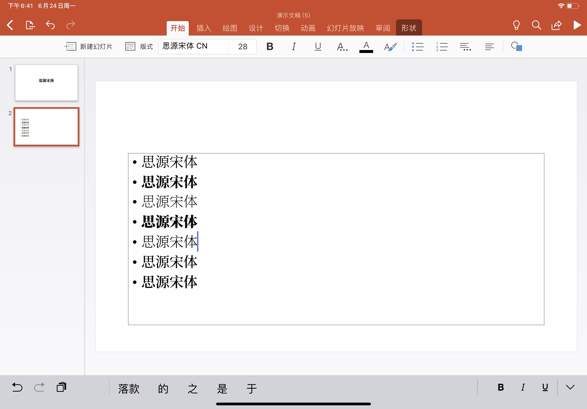
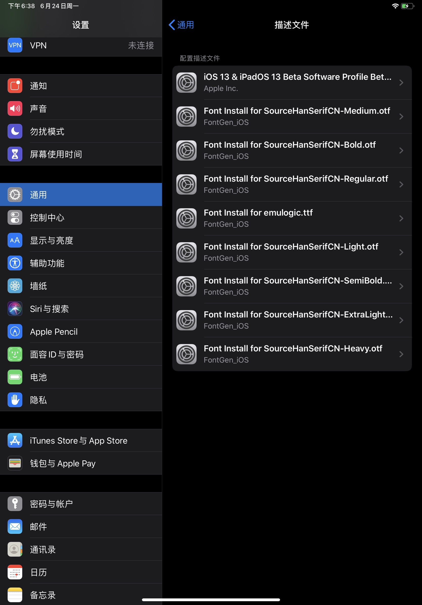

# FontGen_4iOS macOS

[English](readme.md) [简体中文](readme-cn.md)

## What is this for？

This Windows tool is for creating .mobileconfig profiles for installing custom fonts on iOS devices. Currently you need the Apple Configurator 2 on the Mac for doing this. The custom fonts installed on iOS devices can be used within lots of productivity apps like Microsoft Office and Apple iWork.

- English and Traditional Chinese are also supported. The app will switch the language automatically.

## The requirement(s) of this tool

- macOS 10.13 or higher.

- If you want to used the compiled version directly, you need to [enable downloaded app from anywhere](https://techsviewer.com/allow-installation-of-apps-from-anywhere-in-macos-mojave/), by typing *sudo spctl --master-disable* in the terminal.

## Usage

1. Import .otf/.ttf font files. Drag and drop from Finder is supported.

2. Click “Start”，and choose the output folder。

3. Transfer the generated .mobileconfig by some means.

## Attention!

- iOS ONLY supports .otf amd .ttf font files.

- If the generated .mobileconfig file is larger than 20MB, iOS won't recongnize the profile, so please be careful of your font size.

- You must install the profile as soon as the profile was imported to the System Settings. If you import another profile when there's a profile imported but not installed, the previous profile will be overwritten by the new one. (You must install them one by one, especiallly when using AirDrop.)

## Tips：How to import .mobileconfig to iOS devices.

- Upload those files to your iCloud Drive and download them within the built-in Files App.

- Send an email with those files as attachments and open the attachments within the built-in Mail App.

- Upload those files to any http(s) servers or any cloud file services as long as Safari can download them.

- Use AirDrop by any other Apple Devices. ( One profile at a time only)

- Maybe there are other ways to be discovered..

## Is there a Windows version?

- [Here is the Windows version](https://github.com/TomJinW/FontGen_4iOS_Win)

